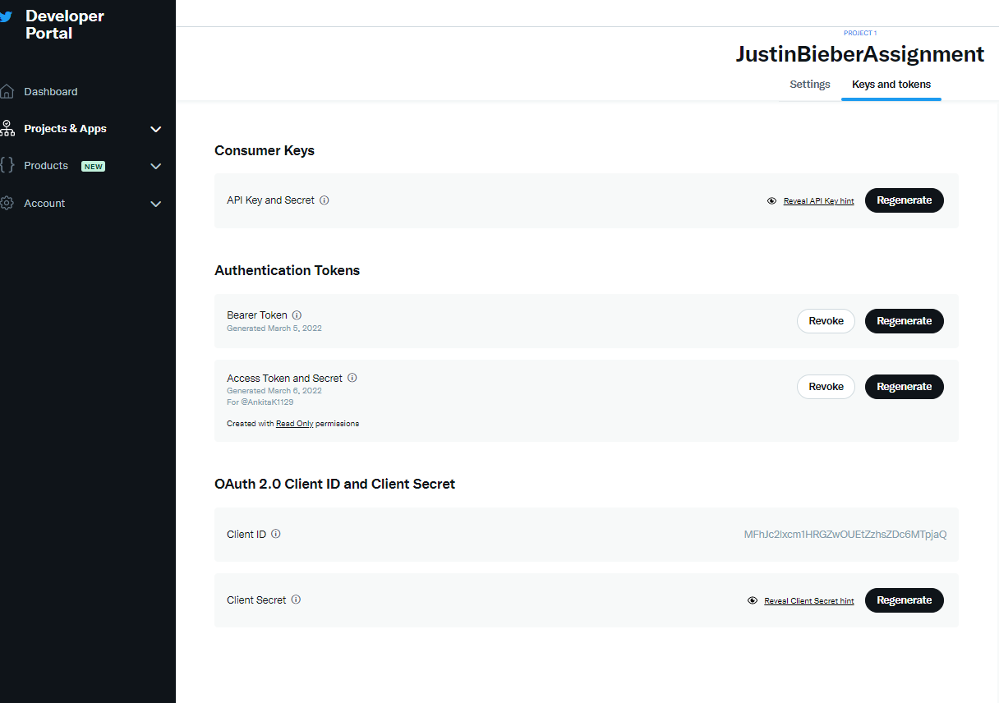
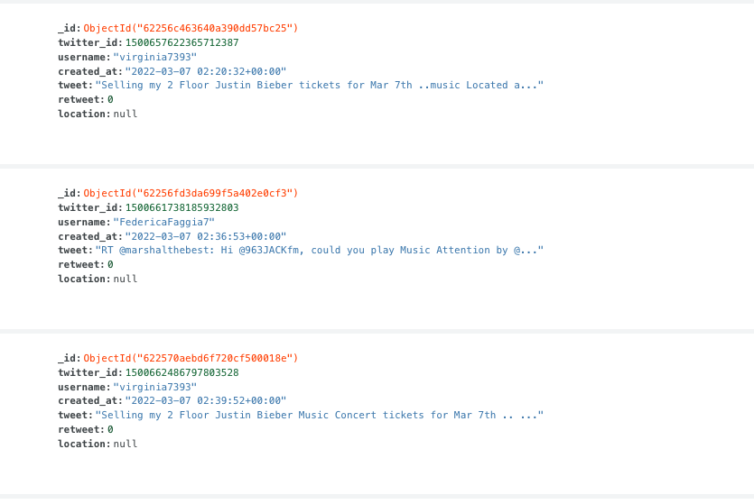
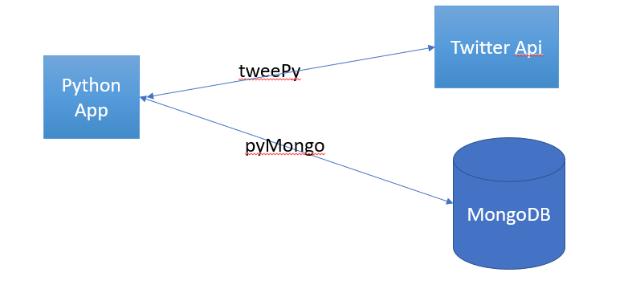
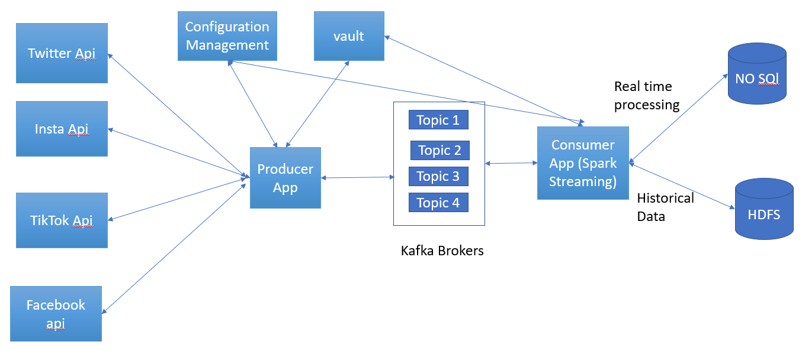

Twitter_Streaming_APP
=====================

Problem Statement: Here we are implementing a pipeline which will stream twitter data and find all tweets consisting of keyword
Justin Bieber and then filter by music; store in any db with no duplicates and find all the total unique tweets
and total tweets consumed.

I have used Tweepy python library to connect twitter streaming API by handling authentication, connection, creating and destroying the session, reading incoming messages, and filtering the data.
 Startup guide:
 1) We will need to have Python 3.8 installed on your machine
 2) Download tweePy library
 Reference:  https://github.com/tweepy/tweepy/tree/master/tweepy
3) Create twitter elevated account access. Please have below twitter account Api access secrets handy.
    1) consumer_key
    2) consumer_secret
    3) api_key
    4) api_secret

 
Useful Reference:
 https://developer.twitter.com/en/support/twitter-api/developer-account
 4) used CookieCutter for the project template
 5) I have used MongoDB free Cloud account to store the tweets data

References:
 https://www.knowi.com/blog/getting-started-with-mongodb-atlas-overview-and-tutorial/

 5) Have MongoDB Connection String handy including Secrets
 6) Please add your PC IP to Mongo DB whitelist IP section in case of an issue where MongoDB reject the connection when you try to conenct your local environment to Cloud MongoDb instance.
 7) I have used pymongo library used to connect to MangoDB. Please install pymongo
 8) Used pyMongo to create Database, Collection and index
 9) Download python NLTK library for tokenizing the twitter text

Current application Flow:

Python Application Start -> tweePY Library -> Connect to Twitter Api
                                   -> Search the Tweets with Justin Bieber
                                   -> Response will be filtered (music) by using NLTK python library
                                   -> Connect to MongoDB using pyMongo
                                   -> Save the data to database collection
                                   -> Allow only unique twitter id's which is equal ttotal count

Output: 

Data filtering steps:
1. Kept a track of Number of tweets: tweetCount
2. Filtering out duplicate tweet by initialising a list and checking if the tweet has already been consumed.
3. Since the previous step has been executed, Number of tweets and Number of unique tweets will remain same.
4. I'm also filtering out on the keyword '#music' or 'music'.

RUN configurations :
----------------------

Risk Involved in building poc pipeline
-----------------------
1) Checkpointing
2) Sliding Window and Window definiton
3) If the size of data increase then it will result in high latency
4) Also if we are looking for almost realtime analysis, then the current approach will fail interms of
scalability and performance
5) Fault Tolerance  (single point of failure)
6) Integration -> An integration technique should be designed to enable efficient operations across different datasets.
7) Privacy,Security ->Techniques for protecting a big data stream dataset before analyzing
8) Load balancing -> As we have only 1 node, the processing will be super slow.
9) Low throughput -> We need to have good replication factor to achieve this.

POC to production ready
-----------------------
Here is the high level that can be used to build MVP deliverable

Assumption: Assuming that this will be limited to twitter search with only 1 search criteria

Production readiness checklist:
CICD: Automated build and deploy pipeline
1) Build a CI pipeline
   1) PR commit to Main branch trigger CI
   2) Build
   3) Unit Test
   4) Code coverage
   5) Security vulnerabilities
2) Build CD
   1) Build to Dev environment
   2) Run regression test suite
   3) Success move on to QA Env,Failure Rollback the application to previous version
   4) Notify the Deployment status to users

Cleaning/ETL:
collecting data and transforming the raw data as required

Test cycle:
1) User acceptance testing
2) Automated Regression test suite that will be triggered as part of CICD
3) Performance Test
4) Disaster recovery test
5) Choas test()

Scalability and Application performance:
1) Horizontal Scaling

Monitoring:
1) Monitoring Producer, consumer apps and infrastructure
2) Build Dashboards to monitor application performance and identify key metrics(Success,failure, error codes etcs)
3) Create alerts and integrate with workflow tools like Airflow

Documentation:
1) Data-pipeline documentation
2) Product documentation
3) Support documentation

POC to production ready
-----------------------

Looking at some of the drawbacks of current POC with large data, here is the system I would like to propose

1) Collecting data from multiple sources
2) Use any pub - sub model and let the producer write to kafka topics in brokers
3) For any configuration ( all 3 environments) use configuration manager (ex:CCM)
4) For all secured credentials store in keyvault/hashicorp
5) Once the data is published to topics, spark streaming will subscribe to topics (in short act as consumer)
6) Define the window and sliding window which will act as batch of RDD or dataframes as per the data
7) For instant reterival and analysis, we will store data in No SQL as it provides the benefits of fast reterival, scability.
8) For any future data analysis on historical data, we will store the data in HDFS as well.
    -> We can achieve optimization here if the size of data is large by following ways
         -> Parquet or ORC format File
         -> Partitioning
         -> Bucketing

With this architecture we can achieve better
1) Scability (horizontal scalability)
2) Performance
3) Loosely coupled
4) Load Balancing
5) Resource Utilization
6) Fault Tolerance
7) Integration

Levels of Efforts
-----------------------

Assumption:
Must have features:
-> New Project ( no references to look at)
->window size = 60minutes
->Search criteria by only 1 field
-> Scability
-> Failover Mechanism
-> Analytics

The level of effort will depend on
1) Level of details known (top-down or bottom-up)
2) Amount of Dependency on other teams
3) Number of resources
4) Identifying the possible risks and assumptions
5) Defining the Scope (preferably MVP's)

Estimate timeline
-----------------------

The timeline estimate depends on several factors (Inclusive of above listed):
1) Understand the requirements like Filtering, volume of data , infrastructure, code development
Keyword search and Ingestion
2) Time Interval - How quickly we want data 1sec,2sec ,
3) How does the Infrastructure resource look like ,
4) depending on the number of input (size of dataset)
5) What are some of good to have features and must to have features in terms of design

